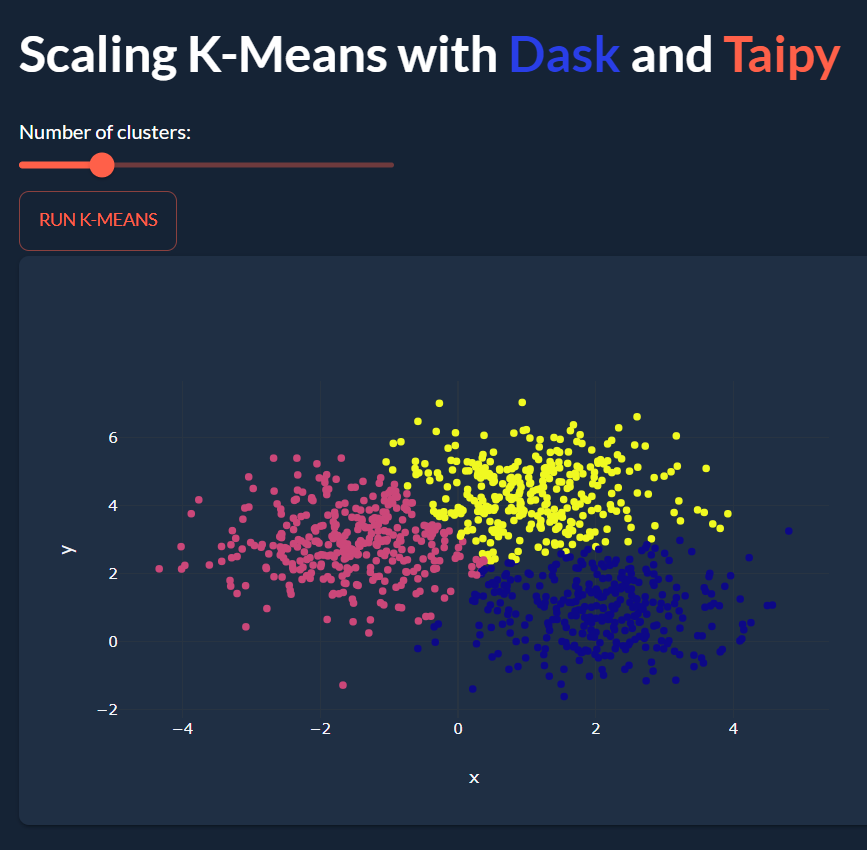
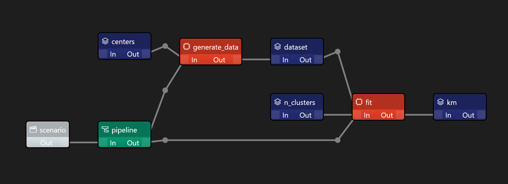
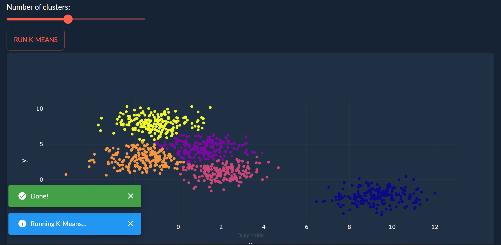

# Scaling ML models with Taipy and Dask

<p align="center">
    </img>
</p>

This project uses Taipy to create a Dask pipeline to create a dataset and run K-Means in parallel. The results are then displayed in a web app.

Taipy is a great way to manage and display the results of Dask applications, as its backend is built for large-scale applications and can handle caching, parallelization, scenario management, pipeline versioning, data scoping, etc.


## Table of Contents

- [Why Taipy?](#why-taipy)
- [Why Dask?](#why-dask)
- [Data Pipeline](#data-pipeline)
- [Web App](#web-app)
- [How to Run](#how-to-run)


## Why Taipy?
Taipy is an open-source Python library that manages both front and back-end:
- Taipy GUI helps create web apps quickly using only Python code
- Taipy Core manages data pipelines through a visual editor where parallelization, caching, and scoping are easily defined

## Why Dask?
Most estimators in scikit-learn are designed to work with NumPy arrays or scipy sparse matrices. These data structures must fit in the RAM on a single machine.

Estimators implemented in Dask-ML work well with Dask Arrays and DataFrames. This can be much larger than a single machine’s RAM. They can be distributed in memory on a cluster of machines.


## Data Pipeline

The Data Pipeline is built using Taipy Studio in VSCode and looks like this:

<p align="center">
    </img>
</p>

Blue nodes are **Data Nodes** that store Python variables or datasets:

- `centers` is an Int with the number of clusters in the dataset we'll create
- `n_clusters` is an Int with the number of clusters we want K-Means to find
- `dataset` is the Dask array of synthetic data created
- `km` is the dask_ml K-Means model

Between the data nodes (in blue) are **Task Nodes** (in orange). Task Nodes take Data Nodes as inputs and return Data Nodes as outputs using Python functions.

These Task Nodes are combined into a pipeline using a green node called the **Pipeline Node**, which is the entry point of the pipeline. (Note that Taipy allows for several Pipelines Nodes to co-exist)

When running the pipeline, Taipy will read the clusters and n_clusters argument, create a synthetic dataset using Dask and run a K-Means model.

## Web App

The web app is built using Taipy GUI and looks like this:

<p align="center">
    </img>
</p>

The app allows you to select a number of clusters using a slider, and the resulting dataset and K-Means clustering will be displayed on a scatter plot.

## How to Run

1. Clone the repository
```
git clone https://github.com/AlexandreSajus/Taipy-Dask-ML-Demo.git
```

1. Install the requirements
```
pip install -r requirements.txt
```

1. Run the web app
```
python app.py
```